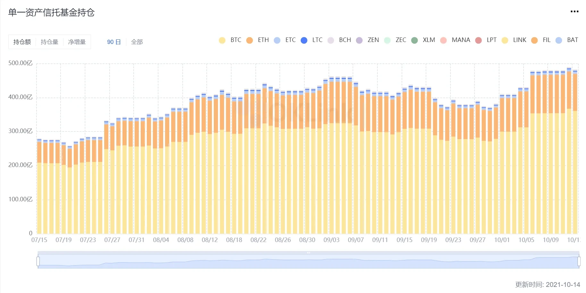
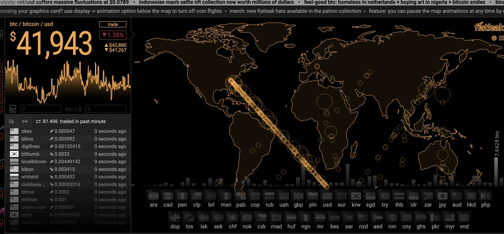
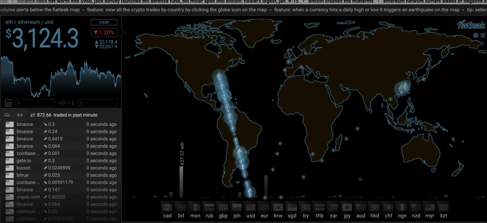
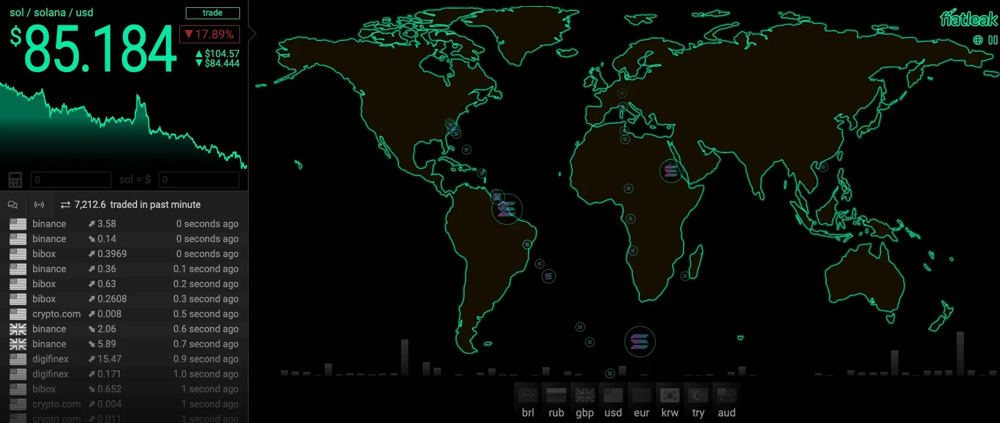
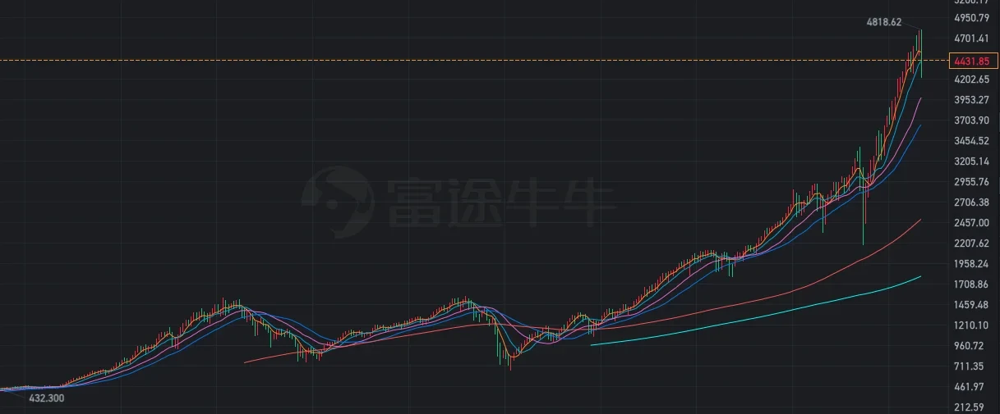
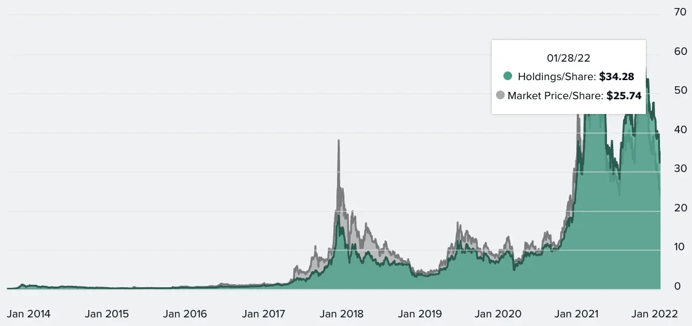
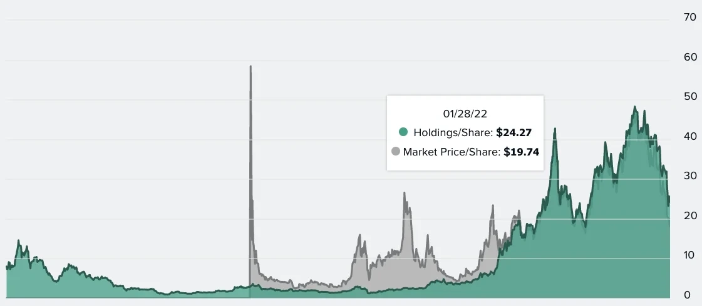
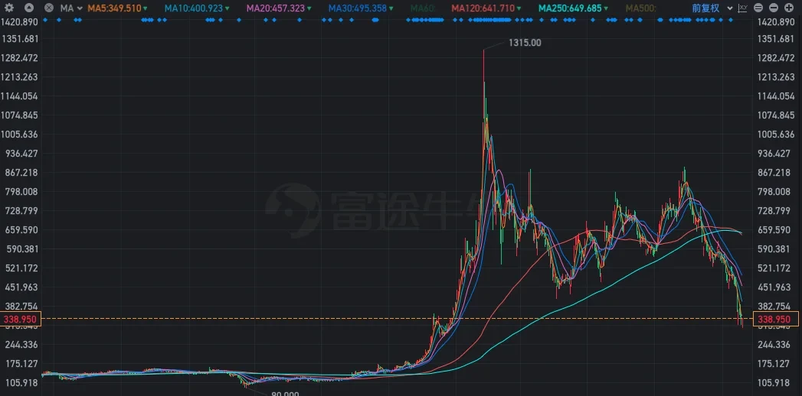

# 来自官方的信息
% 20225-10-07;# btc # wealth @ 财富增值
## 币安

英文

https://www.bnappweb.biz/en-IN/blog/earn/3428929782711269601?ref=CPA_00NKZL97Y5

https://www.bnappweb.biz/en/blog/earn/6295561391839829929?ref=CPA_00NKZL97Y5

中文

https://www.bnappweb.biz/zh-CN/support/faq/detail/bc076f0eb7fb4ae182de6c5eb8968dec?utm_source=new_share&ref=CPA_00NKZL97Y5

首先说一钱包

> **加密钱包**，是管理你在区块链上资产和身份的工具。主要分为以下两种：
>
> - 托管钱包：由**第三方管理**私钥（比如交易所），类似于银行账户，**安全性依赖平台**。
> - 非托管钱包：你**自己掌控私钥**，**完全的去中心化**，安全性则**由你负责**。常见如 MetaMask/Trust Wallet 等。
> - **私钥**，他控制着钱包里的**资产**和**操作权限**，一旦丢失或被泄露，你的任何链上资产或操作都无法恢复。**请务必保护好你的私钥**。re=https://xlog.page/post/chongxi/Welcome-to-xLog

## 机构存了什么

以早期入局者灰度公司（GRAYSCALE）为例：

## ou yi

## 高级的参考: [探索操作指南文章 - 学习数字货币、Web3 和钱包知识 | 欧易](https://www.ouchyi.support/zh-hans/learn/category/trading-ideas)

## 常见问题

什么是赚币 ？

赚币是欧易打造的帮助用户发现多种持币产品机会的一站式服务平台。包括简单赚币、借贷，及链上赚币等产品，为用户提供丰富的产品选择。

什么是年化收益率 (APR)？

APR 是您在赚币产品中充入的代币所获得的年化收益率。

什么时间开始计息/发放收益？

申购不同的产品时，开始计算/发放收益的时间可能不同。以 DeFi 服务为例，每日上午 11:00 左右将用户存入的挖矿资金统一发送至第三方 DeFi 服务的合约地址，资金成功上链后开始计算收益 (因链上操作可能有延迟，以资金实际上链的时间为准)。收益分为利息/奖励，奖励在每天上午 12:00 左右发放，利息和本金在用户赎回订单的次日发放，所有资金均结算至锁仓挖矿账户。

DeFi 项目风险由谁承担？

欧易仅提供第三方 DeFi 平台项目信息展示、数字资产资产上下链、奖励领取和发放服务，不对用户的数字资产进行管理，欧易不承担任何由于合约漏洞、黑客事件、第三方 DeFi 平台暂停、终止业务、倒闭，非正常的暂停或停止交易等潜在风险造成的资产损失。

### 双币赢？

双币赢将帮助用户通过选择不同币对 (如BTC/USDT、ETH/BTC) 进行数字货币买卖。申购之后，用户即可获得其中一种数字货币的稳定收益，直到成功买入或卖出基础币种为止。

产品结算时，若基础币种价格超过目标价，用户将买入或卖出此币种，并获得结算币种的收益，否则用户将收回其申购本金以及相同币种的收益。

回款如何计算？

若您选择高卖策略，那么回款按如下规则决定：

| 结算场景        | 回款金额                         | 回款币种 |
| --------------- | -------------------------------- | -------- |
| 到期价 < 目标价 | 申购数量 × (1 + 收益率)          | 基础币种 |
| 到期价 ≥ 目标价 | 申购数量 × 目标价 × (1 + 收益率) | 计价币种 |

例：您用 10 BTC 申购了高卖 BTC 产品，目标价为 $58,000，收益率为 0.2%：

如果 BTC 到期价 < 58,000，用户收入：

10 × (1 + 0.20%) = 10.02 BTC

如果 BTC 到期价 ≥ 58,000，用户收入：

10 × 58,000 × (1 + 0.20%) = 581,160 USDT

若您选择低买策略，那么回款按如下规则决定：

| 结算场景        | 回款金额                         | 回款币种 |
| --------------- | -------------------------------- | -------- |
| 到期价 > 目标价 | 申购数量 × (1 + 收益率)          | 计价币种 |
| 到期价 ≤ 目标价 | 申购数量 / 目标价 × (1 + 收益率) | 基础币种 |

例：您用 10,000 USDT申购了低买 BTC 产品，目标价为 $50,000，收益率为 1.24%：

如果 BTC 到期日价格 > 50,000，用户收入：

10,000 × (1 + 1.24%) = 10,124 USDT

如果 BTC 到期日价格 ≤ 50,000，用户收入：

10,000 / 50,000 × (1 + 1.24%) = 0.20248 BTC

注意：到期价是指 BTC 指数在产品到期日 15:00 到 16:00 (UTC+8) 的平均价格

相关术语的定义是什么？

基础币种：您希望买入或卖出的币种。

计价币种：用来表示基础币种价格的币种。

目标价：目标价是一个基准价格，用来和到期价做对比，以确定最终结算场景。

到期价：产品到期日 15:00 (UTC+8) ~ 16:00 (UTC+8) 之间基础币种的平均指数价格。

到期日：到期日是您申购的产品结算的日期，具体到期时间设置为到期日的 08:00 UTC。

参考年化收益率 (APR)：产品在一年内的潜在利息收益的近似值。

收益率：产品在其期限内将获得的收益，计算公式如下：

收益率 = 参考年化 × 期限/365

期限：订单持续的天数，用于计算您的收益。订单确认后，您的期限将从下一个整点开始计算。

产品到期后多久可以回款？

通常您的收益将会于到期日 16:30 (UTC+8) 自动结算进入您的资金账户中。实际回款时间可能因结算等因素延迟，延迟时间最多不超过 24 小时，请耐心等待。

产品的提前赎回规则是什么？

1. 我可以在到期日之前赎回吗？

可以。除了 ETH/BTC 之外的所有产品均支持提前赎回。

2. 什么时间可以申请提前赎回？

双币赢各产品提前赎回的窗口期为起息时间至产品到期时间的前一个小时。以如下订单为例：

起息时间：2025年9月1日 16:00 (UTC+8)

到期时间：2025年9月11日 16:00 (UTC+8)

那么您可以申请提前赎回的时间范围是：

开始时间：2025年9月1日 16:00 (UTC+8)

结束时间：2025年9月11日 15:00 (UTC+8)

3. 赎回资金将于何时到账？

如果您在 15:00 点之前申请赎回，您的资金和收益将于当日 16:30 (UTC+8) 左右转入您的资金账户。
如果您在 15:00 点之后申请赎回，您的资金和收益将于次日 16:30 (UTC+8) 左右转入您的资金账户。

4. 提前赎回会产生亏损吗？

申请提前赎回时，系统会即时向用户确认最终的回款金额。该金额可能小于最初的申购金额，即产生亏损。

选择提前赎回时，您只可以赎回申购币种。例如若您使用 BTC 申购，您仅可赎回 BTC，不能选择赎回 USDT。

高收益的产品总是更好的选择吗？

目标价和期限是双币赢产品的两个重要参数，两者之间互相关联。收益率较高的产品以转换币种结算的可能性更高，投资者需要根据自己的偏好进行选择。

为什么此产品中 BETH 和 OKSOL 的价格与其指数价格有差异？

用于确定目标价格和到期价格的“打包 (wrapped)”代币 (BETH 和 OKSOL) 价格，是基于其各自对应质押代币 (ETH 和 SOL) 的指数价格，而非它们自身的指数价格。

虽然代币通常与其质押代币按 1:1 比例挂钩，但两者价格有时会出现偏差。在这种情况下，我们采用质押代币的价格，因此会出现您看到的价格差异。

### vip 屯币

申购 BTC 屯币生息宝可能产生哪些费用？

BTC 屯币生息宝的申购和赎回都不会产生任何手续费。

什么是“计息中”的 BTC 数量？

“计息中”指的是已成功申购，并已于每日 16:00 (UTC+8) 产生收益的 BTC 数量。

什么是“赎回中”的 BTC 数量？

“赎回中”指的是已发起赎回，但赎回尚未完成的 BTC 数量。赎回期间该资金不会产生收益。

如果申购或赎回后想撤销操作该怎么办？

一旦确认申购，您将无法撤销该操作。 您可以通过赎回资金的方式来撤销申购，请参考赎回时间线，进一步了解赎回规则。 如需撤销一笔进行中的赎回申请，您可前往“订单详情 > 赎回中的订单”并取消赎回。

谁可以申购 BTC 屯币生息宝？

目前 BTC 屯币生息宝仅对欧易 VIP 用户开放。如需进一步了解我们的 VIP 项目或者您的 VIP 等级，请前往“我的手续费”。

成功申购后，该产品是否可以一直生息？

BTC 屯币生息宝是一款保本产品，但不能保息。在特定市场行情下，您的每日收益可能接近为零。

赎回周期一般是多长？

若平台即时赎回额度充足，您每日可即时赎回 10 BTC 并享受赎回秒到账。超出额度的部分可常规赎回，并将在 7 天内处理完成。 如遇极端行情或市场流动性不足，赎回可能会有所延迟。欧易保留调整赎回时间的权利，并将第一时间通知您。

什么是即时赎回？

即时赎回功能让您每日最多可从 BTC 屯币生息宝赎回 10 BTC，资金可在几秒钟内到账。即时赎回的每日额度为个人固定额度 (10 BTC) 和平台实时额度中的较小值。其中，平台额度会根据每日的整体赎回量实时更新调整。 即时赎回额度将于每日 16:00 (UTC+8) 刷新。 超出即时赎回额度的部分可常规赎回，并将在 7 天内处理完成。

我的个人申购额度是多少？

您的个人申购额度由您的 VIP 等级以及平台的可用额度决定。 VIP 1：最高 5 BTC VIP 2：最高 10 BTC VIP 3：最高 15 BTC VIP 4：最高 20 BTC VIP 5 及以上：最高 30 BTC 您实际可申购的数额将取决于您的个人额度与平可用额度中的较小值。

### **关于简单赚币**

#### 定期简单赚币

什么是简单赚币？

简单赚币是欧易打造的一款帮助有闲置数字资产用户进行低门槛赚币的产品，入门简单，并提供活期和定期两种选择。

我可以通过定期简单赚币借出哪些币种？

您只能在定期简单赚币中出借 USDT。

什么是出借年化？

出借年化是指当您匹配的借款订单资金筹满后，您的出借订单将赚取的年化收益率。该收益率由欧易根据市场情况为机构借贷用户设定。

我将在何时开始赚取收益？

匹配到的借款订单资金筹集完毕后，您的投资期开始并开始计息。在订单待借出期间，您将不会赚取任何收益。 在待借出期间，如果借款订单未匹配部分被取消，或市场年化收益率发生剧烈变化，已匹配部分将被视为资金筹集完毕，订单期限随即开始。

我的出借订单会被拆分成多个子订单或匹配不同的借款订单吗？

有可能，您的出借订单可能会被拆分为多个子订单以匹配不同的借款订单。 每个子订单的期限和起息时间将从匹配到的借款订单资金筹集完毕时开始。

本金将何时返还？

您的本金将于到期后返还至您的资金账户。

为什么我的订单期限被延长了？

若借款方未按时还款，您的订单会被延期，直到借款方还款为止。订单最多可延期 14 天。 订单延期期间，出借年化将更新为补偿收益 (具体金额可在补偿收益历史页面中查看)，收益将按小时计算。借款方还款后，您借出的资金将连同收益一起发放至您的资金账户。

我可以选择提前赎回吗？

不，只有当您的借款订单状态为“待借出”时，才能选择提前赎回。 一旦借款订单开始生效并且状态变为“赚币中”，您将无法在期限结束前赎回。

订单提前终止时会发生什么？

若借款方提前还款，导致订单在期满前终止，您将获得剩余利息的 100% 作为补偿。若订单接近到期时间时被终止，您将无法获得补偿。

如果有多个子订单，我的订单将在何时结算？

每个子订单的结算时间不同，只有当最后一个子订单到期后，整个订单才算结算完毕。

我的资金会面临风险吗？

是的，您的本金面临风险，包括借款方未能按时还款以及借款方的质押资产不足以偿还借款订单的风险。此外，您的本金还将面临投资数字货币的风险，包括市场波动、交易所风险以及借款方被清算的风险。 虽然欧易通过严格的风险控制、行业领先的安全措施和先进的基础设施来降低这些风险，但您仍然可能面临损失全部或部分本金的风险。

#### 活期

什么是活期简单赚币？

活期简单赚币，是欧易打造的一款帮助有空闲数字资产和有借币需求的用户之间对接的产品，支持 24 小时随存随取，按小时计息。

注：历史收益不能代表未来收益。我们不承诺在一定期限内以货币、实物、股权等方式还本付息或者给付任何其他形式的财产性收益回报。

产品优势

安全可靠

欧易拥有严格的风控体系、领先的安全措施和先进的基础设施，能够充分保障用户资产安全。

灵活申赎

您可以随时在活期简单赚币进行申购和赎回。申请赎回后，您赎回的资金将立即返还至您的资金账户。

相关链接

[活期简单赚币 API 文档](https://www.ouchyi.support/docs-v5/en#financial-product-simple-earn-flexible)

## 欧意-套利怎么做

[实时套利信号助你完成多种套利操作 | 欧易](https://www.ouchyi.support/zh-hans/learn/real-time-arbitrage-signal-cn)

好，我换成“菜市场”说法，再讲一遍——保证听完就能上手。

------------------------------------------------
一、先搞清：到底赚的谁的钱？  
1. 永续合约里，每 8 小时收一次“过夜费”（资金费）。  
2. 如果当时“做多”的人比“做空”多，做多的就给做空的“小费”，反之亦然。  
3. 我们同时“一手做多、一手做空”，两边仓位一样大，价格涨跌跟你无关，你就稳稳地收这笔“小费”。  

------------------------------------------------
二、准备工具（3 分钟搞定）  
1. 一个 OKX 账号，把“统一账户”打开（按钮一点就行）。  
2. 账户里只放 USDT，别的币先不动。  
3. 会下两种单就行：  
   - 永续合约：选“U 本位”，开 5 倍杠杆。  
   - 现货杠杆：还是 5 倍，直接“卖出做空”（系统会自动帮你借币）。  

------------------------------------------------
三、挑币种：只看 2 个数字，别的不管  
1. 当期资金费率 > 0.15%（0.15 下面用“15”表示，方便）。  
2. 近 3 天累计 > 0.5%（50）。  
两个都满足，就把它加入自选；不满足，直接划走。  
（OKX 套利信号页自带这俩数字，已经算好，不用你动手。）

------------------------------------------------
四、下单步骤（以 LAT 举例，照着点鼠标）  
① 永续合约：LATUSDT 永续，开 5 倍，买入开多 2000 个 LAT。  
② 现货杠杆：LAT/USDT 现货，开 5 倍，卖出做空 2000 个 LAT。  
③ 两边仓位价值相同，涨跌互相抵消，你的“本金”几乎不动。  

------------------------------------------------
五、收益怎么来？  
每 8 小时收一次“小费”，公式：  
收益 ≈ 仓位价值 × (资金费率 − 利息)  
用 5 倍杠杆、本金 1000 U 举例：  
- 仓位价值 = 5000 U  
- 当天费率 0.17%，利息 0.05%  
- 每天能收 3 次：5000 × (0.17%−0.05%) × 3 ≈ 18 U  
- 年化 = 18 U × 365 天 ÷ 1000 U ≈ 657%  

（如果换成“交割合约+永续合约”组合，利息是 0%，年化直接再往上飙。）

------------------------------------------------
六、什么时候跑？  
1. 费率变负数（原来你收钱，现在要你掏钱）——立刻平仓。  
2. 持仓价值缩水 20% 以上——说明有人平仓，费率可能跟着掉，也走。  
3. 距离结算不到 2 小时，费率跳水概率大——提前溜。  

------------------------------------------------
七、一句话流程背下来  
“找费率 >15 的币→同时开多空 5 倍→每 8 小时收小费→费率转负就平仓→换下一个币。”  

------------------------------------------------
八、常见坑提醒  
- 千万别只开一边！只做多或只做空，就是赌行情，套利变赌博。  
- 别用 10 倍以上，利息会吃利润，还可能触发梯度保证金。  
- 新币上线头 3 天费率最肥，但记得 72 小时内必走，别贪。  

就这么多，照着点鼠标，先拿 100 U 试一轮，看懂流程后再放大本金。祝你每次“过夜费”都收到手软！

## 欧意-加密货币的春天-和美国越来越一致

# 加密市场正在加速美股化，为什么？

欧易

发布于 2022年12月06日

更新于 2025年2月27日

阅读时长 6 分钟

3

BTC-1.81%

ETH-5.35%

SOL-3.63%

当下，美国市场加密交易量呈上升趋势，成交总量占比从2021年11月份的36%，上升至2022年1月份的43%。

此外，比特币与标普500指数90天相关性触及历史新高，达到0.41，比特币走势与标普500指数在近90天内的有着41%的相似性。回顾历史，2013年以来，两者相关性始终处于-0.2到+0.2之间波动，唯一一次超过0.4发生在2020年4到10月份。此后，一直在0.1以上波动。

说明，加密市场与美股走势强相关，而且加密市场与美股走势一致性越来越高。

数据来源coinmetrics

那么，加密市场是否真的要美股化了？这又会带来哪些影响？

### **1、加密市场为何会美股化？**

在灰度、MicroStrategy、特斯拉等巨头加持下，来自华尔街的行业巨擘与上市公司持有的比特币总量占总流通量的近10%。FiatLeak数据显示，当下主流加密货币正流向北美，这些都是加密圈美股化的重要原因。

FiatLeak指标用于跟踪法定货币与加密资产间的[交易](https://www.ouchyi.support/zh-hans/learn/novice-general-guide-2-cn)，例如，当比特币的最新成交在曼哈顿使用美元进行时，那么图示比特币就会流向美国。下图是比特币在全球各国的流向。

数据来源：fiatleak.com

下图是以太坊流入全球各国的情况。

数据来源：fiatleak.com

下图是Sol流入全球各国的情况。

数据来源：fiatleak.com

谁才是加密世界的王者，一目了然。显然，美国才是加密资产最大买入国。这些共同决定了加密市场的最终走向，即朝着美股化的方向越走越远。

这又会对加密市场产生怎样的积极影响？

很显然，加密市场的美股化，势必会为该市场带来巨量资金，进而实现加密圈投资者所畅想的“永恒牛市”。

回顾标普500指数历史走势，自1993年以来，该指数从底部432点上涨至最高4818点，近30年涨幅超过10倍。

而纳斯达克指数表现则更为夸张，该指数从1991年的353点上涨至近期16000点，30年涨幅超过45倍，虽然纳指遭遇过2000年互联网股泡沫，但泡沫过后的科技股一骑绝尘，从2002年底部的1300点强势飙涨至16000点。

如果加密市场真的能够实现美股化，慢牛与永恒牛市或许会成为现实。不过，需要强调的是，美股股指的“不停涨涨不停”是建立在“国家意志”之上，需要畅通无阻的金融基础设施与强大的用户群体作为基础，需要完善的证券法规范与强有力的监管作为保障。

虽然当下的加密圈具备强劲的创新能力，但并不具备美股“永恒牛市”的基础。此外，由于加密资产过快地朝巨头集中，势必也会带来一些弊端。

例如，当机构不再通过灰度增持比特币时，GBTC严重的负溢价会对整个市场产生巨大的负面影响，再例如负债购买[比特币](https://www.ouchyi.support/zh-hans/learn/what-is-bitcoin-cn-3)，持有比特币总量超过12万枚的MicroStrategy，一旦发生金融危机，是否也会对加密市场产生冲击？

### **2、美股化会带来哪些影响？**

首先，机构将对加密市场产生决定性影响，甚至能够决定牛熊周期。

**以灰度信托为例。**

2013年开始，灰度便开始通过GBTC/ETHE等加密信托大手笔增持加密资产，截止2021年2月份，通过灰度托管的BTC数量达到65.5万枚，这些比特币均为机构买入，交给灰度代为管理，例如大名鼎鼎的罗斯柴尔德家族基金就通过灰度信托持有价值近100万美金的GBTC。

目前，1份GBTC对应0.00092988个[比特币](https://www.ouchyi.support/zh-hans/learn/what-is-bitcoin-cn-3)。早在2014年前，GBTC允许通过灰度赎回实物比特币，2014年被SEC处罚后，GBTC不再支持赎回。

此外，根据《美国1933年证券法》要求，比特币与以太坊等加密资产兑换GBTC/ETHE之后，需要锁仓6个月，之后会被解锁，允许在二级市场[交易](https://www.ouchyi.support/zh-hans/learn/novice-general-guide-2-cn)。其他加密资产兑换成相应信托之后，需要锁仓12个月才能在二级市场交易，例如莱特币（LTC）被兑换成LTCN信托之后，需要锁仓12个月，之后才能解锁，并在二级市场流通。

2020年3月份至2021年1月份，灰度总管资产总额，从30亿美元暴涨至600亿美元，涨幅20倍，BTC价格从3000美元暴涨至4.1万美元，灰度堪称牛市发动机。

此外，牛市进程中，GBTC一直保持5%到15%的正溢价。历史上，GBTC最高正溢价发生在2017年12月份，达到150%。以太坊信托同样如此，本轮牛市进程中，ETHE一直保持10%到20%的正溢价。历史上，ETHE最高正溢价发生在2020年6月份，达到1200%。

时过境迁，灰度信托已变得不那么“香甜”，甚至有些令人“生厌”。

最新数据显示，GBTC负溢价达到25%，ETHE负溢价达到19%。此外，自2021年2月份之后，几乎所有的灰度信托均进入负溢价区间，这一趋势一直延续至今。此外，自2021年2月份至今，机构几乎不再通过灰度增持加密货币，这也是本轮熊市的起点。

一方面说明了华尔街机构对后市的看法，另一方面也彰显了加密市场过于集中化带来的弊端，即灰度一家就能决定加密市场走势。

再以MicroStrategy为例。

2022年1月份以来，MicroStrategy股价从560美元暴跌至300美元，跌幅高达46%，虽然这与比特币价格下跌有一定关系，但根本原因在于SEC驳回了该公司的NON-GAAP会计策略。

所谓NON-GAAP会计策略，是指在统计资产负债时，帐上的BTC只计盈利，不计亏损。SEC驳回NON-GAAP会计，改用GAAP会计策略之后，正好颠倒过来，账上BTC只计亏损，不计盈利。

那么，这是否会导致Microstrategy陷入恐怖的死亡螺旋？即比特币价格下跌——股价下跌——融资能力下跌——破产——比特币遭到清算。

要知道，Microstrategy股票MSTR之所以能够在2021年2月份飙涨至1315美金，就在于其大手笔购入比特币。而且还能够在今年6月份发行6亿美金的垃圾债券，用于购买比特币。目前，Microstrategy共持有比特币124,391个，均价29,900美元，价值47亿美元。而Microstrategy美股总市值仅为35亿美元。

当下，在GAAP会计策略与BTC价格下跌的双重打击下，Microstrategy最终是否会陷入破产？

此外，根据Microstrategy 2021年Q3财报，亏损高达3610万美元，在核心业务亏损，比特币大幅下跌，且来自比特币的投资亏损被计算在资产负债表的情况下，Microstrategy是否会面临流动性枯竭，并陷入举步维艰的境地，假设最终破产资产遭清算，12万个比特币对市场的破坏力将会是毁灭性的。

综上，在华尔街强大的资本控场能力下，加密市场已不再是那个“没人要的孩子”，早已变成巨鲸的乐园，但更大体量的巨鲸也会产生更大规模的“鲸落”，当然

## ouyi-blog-游戏币攒钱？

[一文盘点最火爆的5款链游，全面解析GameFi密码 | 欧易](https://www.ouchyi.support/zh-hans/learn/gamefi-cn)

这篇文章的核心内容是在**分析GameFi（区块链游戏）如何盈利、有哪些代表项目、以及其潜在价值**。下面是简明总结与盈利逻辑提炼👇

------

### 🧩 一、GameFi 的核心逻辑：怎么赚钱？

GameFi 是 **Game + DeFi + NFT** 的融合，核心盈利逻辑主要有以下几种：

1. **Play-to-Earn（边玩边赚）**
    玩家通过完成任务、打怪、竞赛等获得代币或NFT，再在市场上卖出获利。
    → 类似“玩游戏挖矿”。
2. **NFT 资产升值**
    游戏中的宠物、装备、土地等都可作为NFT交易，稀有程度高的资产可升值转卖。
3. **代币经济**
    每个游戏通常有治理代币和游戏代币两种：
   - 游戏代币：完成任务、比赛奖励获得，可在交易所出售；
   - 治理代币：可质押、参与治理、分红等，价格受社区发展影响。
4. **DAO与经济体参与**
    玩家可通过DAO（去中心化自治组织）参与决策、治理和收益分配，甚至成为“虚拟经济体”的一部分（如YGG公会）。
5. **投资/质押收益**
    一些游戏代币可在DeFi协议中质押，赚取利息或新代币奖励。

------

### 🕹️ 二、5款代表性链游的盈利机制

| 游戏                  | 盈利方式                                                   | 特色与亮点                                                 |
| --------------------- | ---------------------------------------------------------- | ---------------------------------------------------------- |
| **1️⃣ Axie Infinity**   | - 玩游戏得SLP- 卖Axie宠物或土地- 交易分成- AXS治理收益     | 经典Play-to-Earn模型；曾让玩家月赚数千美元；有完整经济闭环 |
| **2️⃣ Illuvium**        | - 捕捉怪兽NFT后卖出- 完成任务获ILV- 质押ILV分红            | 高质量RPG；NFT融合稀缺性+DeFi收益；DAO治理体系             |
| **3️⃣ Aavegotchi**      | - 抵押aToken召唤NFT幽灵- 质押GHST赚积分/彩票- 卖装备、土地 | 将DeFi代币质押+NFT结合的典范；多层玩法                     |
| **4️⃣ Zed Run**         | - 赛马赢奖金- 繁殖优质赛马售卖- NFT赛马升值                | 真实模拟赛马经济；未来可发展元宇宙生态职业体系             |
| **5️⃣ Nine Chronicles** | - 玩游戏挖矿得NCG- 卖装备、物品- 排行奖励                  | 完全去中心化RPG；社区驱动；由育碧等大厂支持                |

------

### 💰 三、项目方（开发者）如何盈利？

1. **NFT销售收入**：如Axie的宠物、土地初次发售。
2. **市场交易抽成**：每笔玩家间交易抽取一定比例手续费（通常2.5%~5%）。
3. **代币发行和增值**：早期发币融资，随着游戏热度上涨，代币升值。
4. **生态合作与DAO分润**：如与YGG公会、NFT平台合作分成。

------

### 📈 四、GameFi 的投资价值与风险

**价值：**

- 把玩家变成“股东”与“参与者”，增强粘性。
- NFT资产+DeFi收益的创新组合。
- 可能成为下一代“虚拟经济体”入口。

**风险：**

- 模式可持续性不强：若玩家减少，代币价格容易崩。
- 早期项目投机性高，容易泡沫化。
- 游戏可玩性普遍不足，吸引力短期化。

------

### 🎯 总结一句话

> **GameFi的核心价值在于“让游戏内时间与资产变现”，盈利来自代币激励、NFT交易与生态分润。**
>  未来能持续赚钱的项目，必须既能吸引玩家留存，又能维持稳定的代币经济模型。

------

是否希望我帮你把这些内容整理成一份「GameFi盈利逻辑图」或「项目收益对比表」？那样你可以更直观地看到各游戏的赚钱方式。

# 一个骗局--巨量的财富正在英国发生的

2018年，区块链行业从2017年的狂热迅速跌入低谷，主要原因可以归结为以下几点：

---

### 1. **ICO泡沫破裂，项目大面积破发**
2017年ICO（首次代币发行）火爆，大量项目通过白皮书融资，但2018年这些项目集中上线交易所后，**破发率超过95%**，部分代币跌幅甚至超过99%，被市场视为“空气币”。投资者信心严重受挫，市场进入恐慌性抛售阶段。

---

### 2. **加密货币价格暴跌，市场进入熊市**
2017年底比特币价格接近2万美元，但2018年全年持续下跌，**年底跌至约3800美元，跌幅超80%**。其他山寨币跌幅更为惨烈，部分币种跌幅超过95%。整个加密数字货币市值从年初的2973亿美元跌至1111亿美元，**蒸发近73%**。

---

### 3. **监管趋严，政策打压加剧**
2018年，中国等国家加强对虚拟货币和ICO的监管。例如，**“区块链信息利箭行动”**中，大量区块链自媒体被封号，主流平台封杀“一夜暴富”类宣传。原央行行长周小川也明确表示，虚拟货币交易不应脱离服务实体经济的方向。

---

### 4. **安全问题频发，信任危机加剧**
2018年区块链安全事件频发，**全年因安全问题造成的经济损失高达27亿美元**，包括交易所被黑、智能合约漏洞、钱包被盗等。这些问题进一步削弱了公众和投资者对区块链技术的信任。

---

### 5. **市场投机退潮，资本回归理性**
随着币价暴跌和监管加强，**大量投机者退场**，市场开始洗牌。资本逐渐从“炒币”转向关注底层技术和实际应用场景，如DApp、供应链金融、版权保护等。

---

### 总结：
2018年区块链的低潮，是**泡沫破裂、市场调整、监管打压、安全危机和资本理性回归**共同作用的结果。这场“寒冬”虽然残酷，但也为行业的长期健康发展清除了大量噪音和泡沫，推动了区块链技术向更务实、规范的方向发展。

故事的起始，可以追溯到2014年中国天津的一间公司——**蓝天格锐电子科技有限公司**。

这家公司由一位名叫**钱志敏**的女子实际控制。她对外以“财富管理”“科技创新”为幌子，推出所谓“多特币”投资项目，承诺“投入6万元，两年半返还19万”，年化收益高达100%～300%。她甚至戴上粉色面纱、化名“花姐”，营造神秘高科技企业家形象，吸引投资者信任。

从2014年到2017年，这场精心包装的**庞氏骗局**迅速蔓延全国31个省市，**共吸引近13万名中国投资者，涉案金额高达430亿元人民币**。

然而，这只是故事的开端。2017年，中国监管风暴来袭，ICO和虚拟货币交易被全面叫停。钱志敏闻风而动，**将所有诈骗所得兑换成比特币**，伪造身份、持假护照潜逃英国，开启了这场跨国洗钱与逃亡的下一幕。

她并不知道，自己即将在英国，与一个名叫**简雯**的普通华裔女子相遇，而这，将成为她命运转折的开始。

故事继续发展，进入英国篇章。

2017年，钱志敏（化名张雅迪）携带着诈骗所得的430亿元人民币，伪造身份、持假护照，悄然潜逃至英国。她深知自己已被中国警方通缉，因此行事极为谨慎，频繁更换名字，如“Rose”“Emma”“花花”等，并刻意避开与中国有引渡协议的国家，只在安全地带活动。

抵达英国后，钱志敏并未低调行事太久。她开始寻找一个可以协助她处理巨额比特币、同时又能隐藏身份的人。这个机会很快出现了——**简雯（Jian Wen）**，一位生活在英国利兹的华裔单亲妈妈，进入了她的视野。

简雯出身普通，早年随丈夫移居英国，婚姻破裂后独自抚养儿子，生活拮据。她在中餐馆打工，靠微薄的收入维持生计。2017年某天，她在微信上看到一则招聘“私人管家”的广告，出于改善生活的渴望，她联系了雇主——正是钱志敏。

两人在伦敦肯辛顿的五星级酒店首次见面。钱志敏以神秘富豪的身份出现，承诺给予简雯高薪与优渥生活。简雯被突如其来的“幸运”冲昏头脑，欣然接受邀请，成为她的“生活助理”。

从此，简雯的生活发生翻天覆地的变化。她搬入豪宅，开始陪同钱志敏出入高端场所，甚至试图购买价值2350万英镑的别墅、价值数百万英镑的珠宝与艺术品。她还协助钱志敏处理比特币钱包、开设加密账户、购置房产与奢侈品，成为其洗钱链条中的关键一环。

然而，正是这种极度奢靡的生活方式，引起了英国警方的注意。2018年，伦敦警方在一次反洗钱行动中突袭了简雯的住所，**查获了存储有6.1万枚比特币的数字钱包**，当时价值约14亿英镑，成为英国历史上最大规模的加密货币扣押案。

警方调查发现，这些比特币正是来自中国“蓝天格锐”诈骗案的资金。简雯被捕后，试图解释这些财富是“合法投资所得”，但无法提供任何可信来源。2024年，她被英国法院判处**6年8个月监禁**，罪名是**协助洗钱**。

而主谋钱志敏，则在警方行动前悄然脱身，目前仍在逃。她留下的6.1万枚比特币，如今价值已超过**50亿英镑**，成为英国政府财政的“意外之财”，也引发了中英之间关于资产归属的争议。

这场跨越中英两国、历时七年的惊天骗局，至此仍未完全落幕。简雯锒铛入狱，钱志敏下落不明，而13万中国投资者的损失，仍在等待一个交代。

## 寒冬？大家要稳定币？

这篇文章的核心在于解释 **“USDT场外溢价”与市场行情、资金流动、套利机会之间的关系**。如果从“如何通过它赚钱或获取回报”的角度来看，可以总结出以下几点要点和潜在盈利逻辑👇

------

### 💡一、什么是USDT场外溢价

- **定义**：USDT场外溢价 = USDT场外价格 / 美元汇率 × 100%。
  - 当>100%时为**正溢价**（买USDT的人多，需求旺盛）；
  - 当<100%时为**负溢价**（抛售USDT的人多，市场低迷）。
- 这个指标是**加密市场资金流入或流出的晴雨表**，常用于判断市场情绪。

------

### 💰二、盈利逻辑1：低买高卖的**跨市场套利**

- 当USDT**负溢价**时，可以：
  1. 在场外市场（如人民币OTC区）**低价买入USDT**；
  2. 再将USDT转入交易所；
  3. 在行情回暖时（溢价回升）**卖出USDT或换回法币**；
      👉 **赚取价差收益**。
- 当USDT**正溢价**时，则可以：
  1. 在场内或海外平台（价格接近1美元）买USDT；
  2. 再到场外溢价高的地区**卖出换成人民币**；
      👉 获得**套利空间**。

⚠️ 注意：这种套利通常收益在**0.5%~2%之间**，但需考虑汇率、转账、到账延迟、KYC审核等成本。

------

### 📈三、盈利逻辑2：用溢价指标预测市场趋势

- **正溢价扩大** → 表明场外资金大量流入，可能是牛市初期信号；
- **负溢价扩大** → 表明投资者逃离市场，可能是行情下跌或恐慌阶段；
- 因此，USDT溢价率可以作为一种**“市场热度指标”**，帮助你判断：
  - 是否该加仓（资金流入阶段）；
  - 是否该减仓或避险（资金撤离阶段）。

------

### 🔁四、盈利逻辑3：结合交易所间价格差的**跨所套利**

- 不同交易所（币安、欧易、Bybit）之间的USDT/CNY报价会有轻微差异；
- 通过**低价买入、高价卖出**可实现稳定收益；
- 若平台内**USDC/USDT无手续费兑换**（如币安、OKX），可进一步降低成本，增强套利空间。

------

### 🏦五、机制层面（供需与增发）

- 当USDT价格上涨（正溢价），Tether通常会**增发**USDT供应；
- 当USDT价格下跌（负溢价），则会**回收或销毁**部分USDT；
- 这使得长期看USDT仍保持稳定，但**短期溢价波动提供套利机会**。

------

### ⚠️六、风险与注意事项

1. 场外OTC交易存在**账户冻结、身份审查、资金延迟**风险；
2. 市场波动剧烈时，**溢价消失速度很快**，套利窗口短；
3. 涉及法币出入的操作需符合所在地区**监管与合规要求**；
4. 若交易量小于手续费或汇率变动，**可能得不偿失**。

------

✅ **总结一句话**：

> “USDT场外溢价”既是市场情绪晴雨表，也是短期套利的风向标。
>  当你能同时关注不同平台、不同区域USDT价格波动时，就能捕捉到**低买高卖**的价差收益机会。

------

如果你希望我帮你做一个「**实时监测USDT溢价+套利机会提醒脚本**」（比如Python或JS实现），我可以直接帮你写出来，监测币安/OKX的场外价与美元价格，计算套利空间。
 是否需要我帮你实现这个？